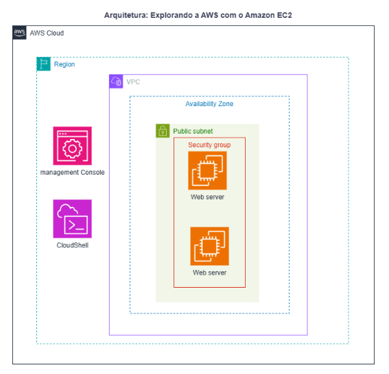
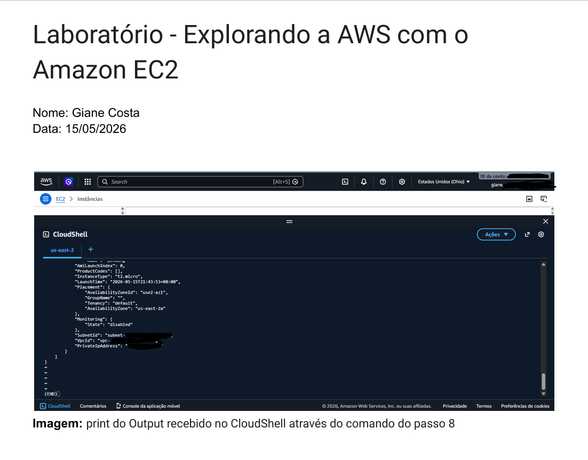

# Laboratório 01: Explorando a AWS com o Amazon EC2

## 📝 Descrição do Projeto
Este laboratório teve como objetivo fornecer uma visão básica e prática sobre o provisionamento de instâncias do Amazon Elastic Compute Cloud (EC2). Nele, explorei a criação de servidores virtuais tanto pelo Console de Gerenciamento da AWS quanto de forma automatizada via linha de comando utilizando o CloudShell.



## 🎯 Objetivos Concluídos
* Inicialização de um servidor web de teste (Apache) via Console da AWS.
* Configuração de Security Group para permitir tráfego na porta 80 (HTTP).
* Provisionamento automatizado de uma segunda instância utilizando o AWS CLI no CloudShell.
* Prática de encerramento de recursos e limpeza do ambiente para evitar custos desnecessários.

## 💻 Comandos Utilizados no CloudShell

### 1. Definição de Variáveis de Ambiente
```bash
GRUPO_SEGURANCA="seu-nome-grupo"
NOME_INSTANCIA="instancia-seu-nome"
PAR_CHAVE="parchave-seu-nome"
```
### 2. Criação do Security Group
```bash
SECURITY_GROUP_ID=$(aws ec2 create-security-group --group-name $GRUPO_SEGURANCA --description "Permitir HTTP" --query "GroupId" --output text)
```
### 3. Liberação da Porta 80 (HTTP)
```bash
aws ec2 authorize-security-group-ingress --group-id $SECURITY_GROUP_ID --protocol tcp --port 80 --cidr 0.0.0.0/0
```  
### 4. Criação da Instância com Script de User Data
```bash
aws ec2 run-instances \
  --instance-type t2.micro \
  --image-id $(aws ssm get-parameters-by-path --path "/aws/service/ami-amazon-linux-latest" --query "Parameters[?ends_with(Name, 'al2023-ami-kernel-default-x86_64')].Value" --output text) \
  --security-group-ids $SECURITY_GROUP_ID \
  --tag-specifications "ResourceType=instance,Tags=[{Key=Name,Value='$NOME_INSTANCIA'}]" \
  --key-name $PAR_CHAVE \
  --user-data "IyEvYmluL2Jhc2gKZG5mIGluc3RhbGwgLXkgaHR0cGQKc3lzdGVtY3RsIGVuYWJsZSAtLW5vdyBodHRwZAppY2hvICc8aHRtbD48aDE+T2zDoSBlbyBzZXUgc2Vydmlkb3Igd2ViITwvaDE+PC9odG1sPicgPiAvdmFyL3d3dy9odG1sL2luZGV4Lmh0bWw="
```

## 🔍 Aprendizados e Conclusões
* **Infraestrutura como Código (IaC):** A experiência de criar os mesmos recursos via console e depois usando o AWS CLI no CloudShell destacou claramente o poder da automação. Comandos e scripts reduzem o erro humano e permitem escalar a infraestrutura em poucos segundos.
* **Segurança em Camadas:** Compreendi a importância dos *Security Groups* funcionando como firewalls virtuais de controle de tráfego, garantindo que apenas as portas estritas (como a porta 80 para HTTP) fiquem expostas à internet.
* **Automação de Inicialização:** O uso de *User Data* para automatizar tarefas repetitivas (como atualizar o sistema, instalar e ativar o servidor Apache) demonstra como provisionar ambientes prontos para produção de forma ágil.

## 🚀 Próximos Passos
Pretendo expandir este laboratório no futuro aplicando os seguintes conceitos:
1. Criar uma AMI personalizada a partir deste servidor web configurado.
2. Implementar um Application Load Balancer (ALB) para distribuir o tráfego.
3. Configurar um grupo de Auto Scaling para garantir alta disponibilidade da aplicação.

## 📸 Evidência de Sucesso (Output JSON)
Abaixo está o registro do output gerado no terminal do CloudShell, demonstrando o retorno da estrutura JSON com os dados da instância criada com sucesso:

