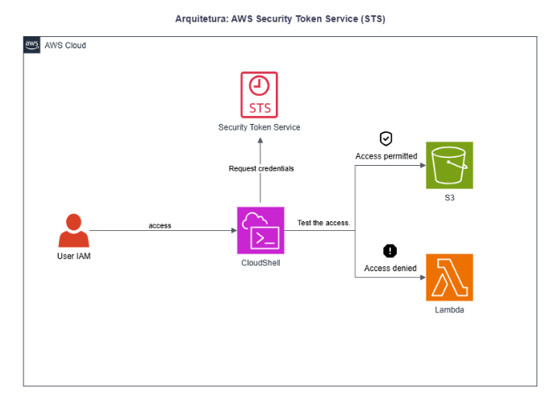
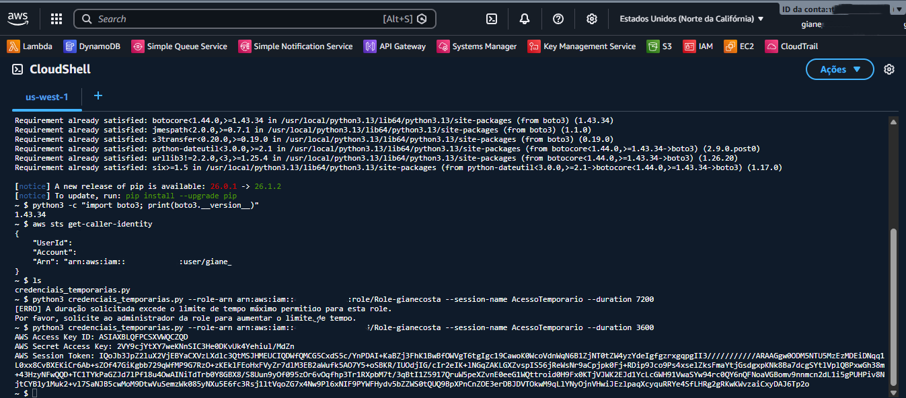
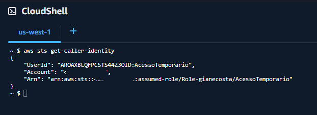
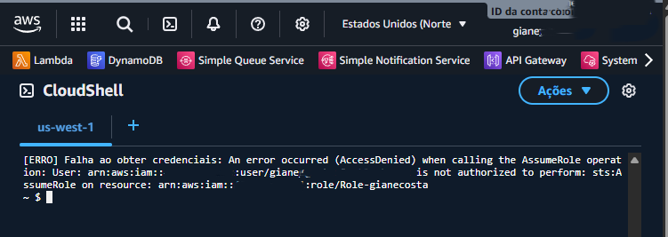

# Lab 10: AWS Security Token Service (STS) — Credenciais Temporárias e Governança IAM 🔐☁️

## 📖 Descrição do Projeto
Este laboratório prático demonstra a implementação de boas práticas de segurança e governança de identidades na nuvem utilizando o **AWS Security Token Service (STS)**. O objetivo foi mitigar riscos associados a credenciais de longo prazo, substituindo-as pelo provisionamento dinâmico de credenciais temporárias com escopo e tempo de expiração estritamente delimitados.

Durante o laboratório, foi criada uma role IAM customizada com acesso temporário ao Amazon S3. Através da execução de scripts em Python no AWS CloudShell utilizando a biblioteca Boto3, as credenciais de sessão foram geradas, configuradas na AWS CLI e testadas sob o princípio do privilégio mínimo. O projeto também validou o comportamento da infraestrutura durante cenários de expiração de sessão e modificação de políticas de confiança (Trust Relationships).

---

## 🏗️ Arquitetura e Fluxo do Laboratório

1. **Criação da Role IAM:** Provisionamento de uma Role temporária atrelada a uma política de confiança personalizada e permissão restrita (`AmazonS3FullAccess`).
2. **Geração de Token (Python + Boto3):** Execução de script automatizado via AWS CloudShell consumindo a API do AWS STS para solicitar credenciais efêmeras.
3. **Configuração da AWS CLI:** Injeção manual das chaves temporárias (`Access Key ID`, `Secret Access Key` e `Session Token`) no ambiente local do terminal.
4. **Auditoria de Identidade:** Validação de segurança com o comando `get-caller-identity` para confirmar a assunção da identidade temporária.
5. **Teste de DevSecOps (Quebra de Confiança):** Alteração do JSON da política de confiança da Role para validar o bloqueio imediato de novas requisições de STS (Access Denied).

---

## 🛠️ Tecnologias e Ferramentas Utilizadas

| Categoria | Ferramentas |
| :--- | :--- |
| **🔐 Segurança & Identidade** | AWS STS (Security Token Service), IAM Roles, Trust Policies |
| **🗄️ Armazenamento** | Amazon S3 (Simple Storage Service) |
| **⚙️ Automação & Scripting** | Python, Boto3 SDK, AWS CloudShell |
| **💻 Interface de Linha de Comando** | AWS CLI, Bash Terminal |

---

## 📸 Evidências do Laboratório

### 1. Geração de Credenciais Temporárias via Python & STS
Execução do script Python consumindo a API do STS para gerar chaves criptográficas de sessão com tempo de expiração delimitado em 3600 segundos (1 hora).

### 2. Validação da Identidade Assumida na AWS CLI
Execução do comando de auditoria de chamadas demonstrando a transição bem-sucedida da identidade do usuário original para o escopo restrito da Role Temporária.

### 3. Teste de Resiliência Securitária (Relação de Confiança)
Evidência do bloqueio de chamadas à API e retorno de erro de Acesso Negado (Access Denied) após a modificação intencional da política de confiança (Trust Relationship) da Role, validando os mecanismos de controle de acesso do IAM.

---

## 🧠 Aprendizados Consolidados

* **Mitigação de Vetores de Ataque:** Compreensão prática de como o uso de credenciais de curto prazo reduz drasticamente o impacto de vazamentos acidentais de chaves de acesso.
* **Consumo Dinâmico de APIs de Segurança:** Utilização da biblioteca Boto3 para automatizar chamadas de infraestrutura e gerenciamento de sessões de segurança.
* **Políticas de Confiança (Trust Relationships):** Entendimento de que uma Role IAM não depende apenas de suas permissões internas, mas sim de quem está explicitamente autorizado a assumi-la via JSON.
* **Configuração Avançada de CLI:** Manipulação manual de arquivos de configuração da AWS CLI para injeção de parâmetros de `aws_session_token`.