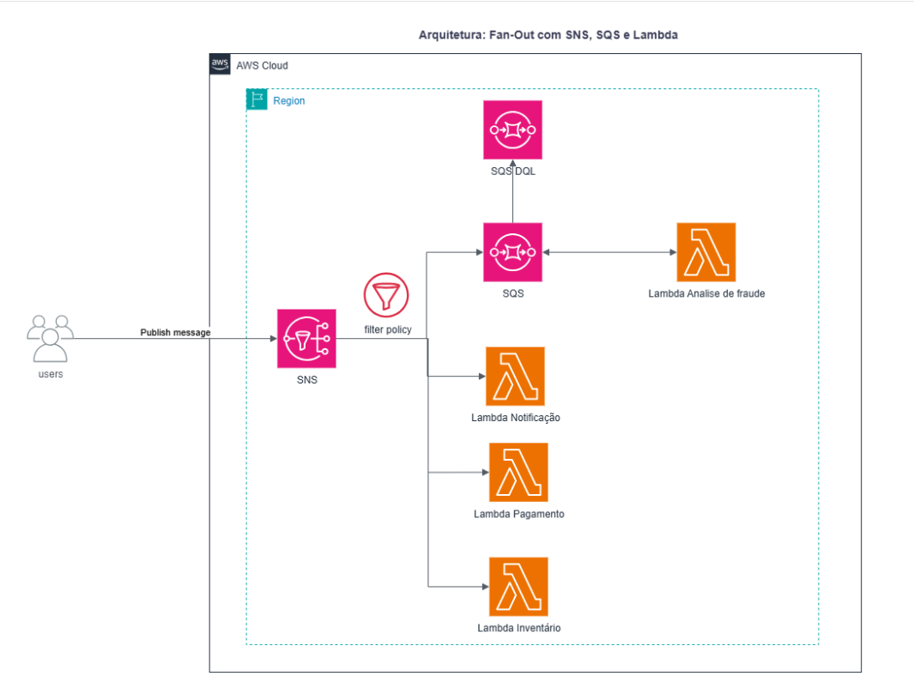
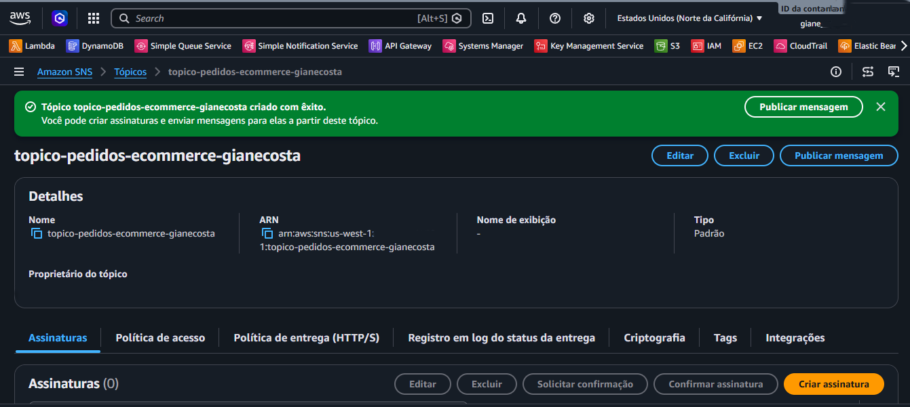
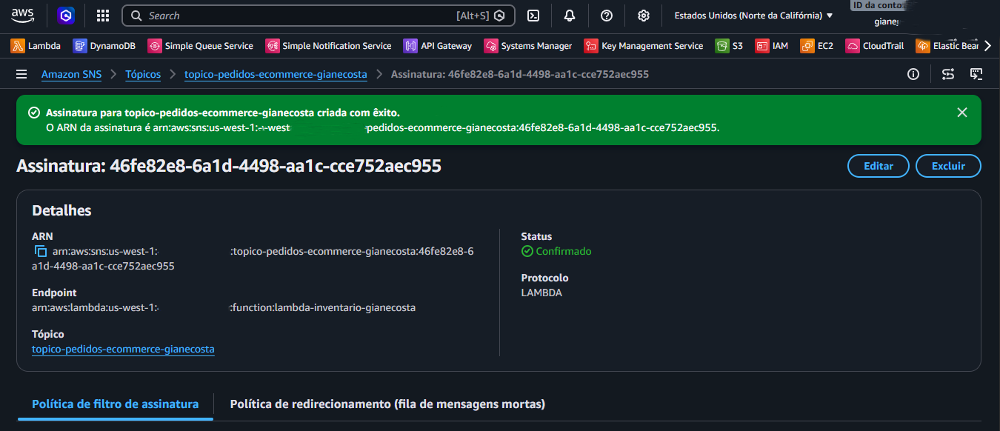
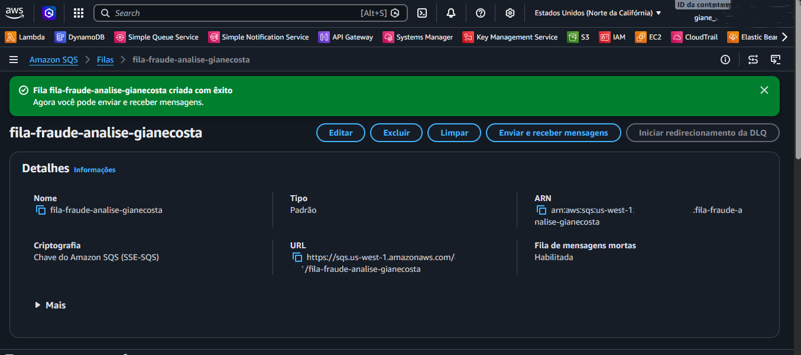
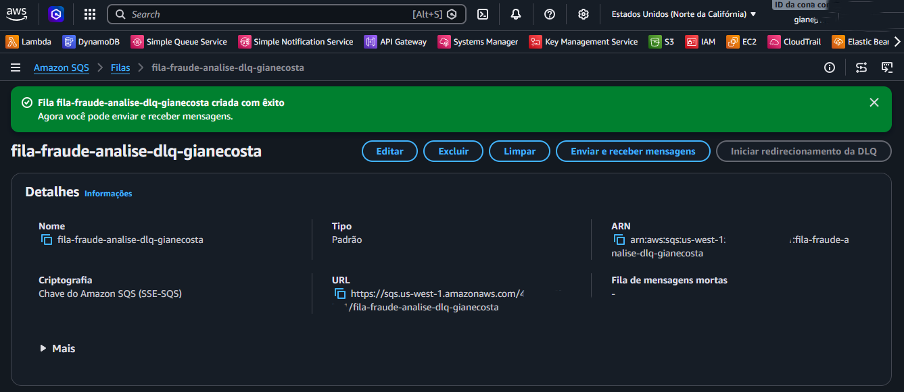

# Laboratório - Arquitetura Fan-Out com SNS, SQS e Lambda

## 📋 Descrição do Projeto
Este repositório contém a documentação e os artefatos do **Laboratório 12** da trilha AWS Developer na Escola da Nuvem. O objetivo prático foi implementar uma **Arquitetura Fan-Out** resiliente e totalmente desacoplada para simular o processamento de pedidos de um e-commerce em paralelo.

A solução utiliza o **Amazon SNS** como hub central para distribuir mensagens de forma assíncrona para múltiplas funções **AWS Lambda** e uma fila do **Amazon SQS** equipada com **Dead-Letter Queue (DLQ)** para tratamento de falhas, utilizando **Políticas de Filtragem de Assinatura** para otimização do fluxo.

---

## 🏗️ Arquitetura do Sistema



* **Publisher:** Publica o payload do pedido com atributos específicos no tópico central do SNS.
* **Amazon SNS (Tópico):** Recebe e distribui as mensagens para os inscritos com base em regras granulares de filtragem.
* **Filtros de Assinatura (Subscription Filter Policies):** Roteiam as mensagens de forma cirúrgica para que cada consumidor processe apenas o que for relevante.
* **AWS Lambda (Inscrições Diretas):** Funções assíncronas paralelas para `Atualizar Inventário`, `Processar Pagamento` e `Notificar Cliente`.
* **Amazon SQS + Lambda (Inscrição Indireta):** A fila `fila-fraude-analise` atua como um buffer resiliente para a função de Análise de Fraude.
* **SQS DLQ (Dead-Letter Queue):** Fila de isolamento criada para capturar e reter mensagens que falham consecutivamente no processamento.
* **Amazon CloudWatch Logs:** Centralização de logs para monitoramento e rastreabilidade.

---

## 🛠️ Componentes e Códigos Desenvolvidos

### Funções Lambda (Python 3.12)
1. **lambda-inventario:** Acionada quando `EventType` é `OrderPlaced` ou `InventoryCheckRequired`.
2. **lambda-pagamento:** Acionada quando `EventType` é `OrderPlaced` E `PaymentType` é `CreditCard` ou `Boleto`.
3. **lambda-notificacao-cliente:** Acionada quando `EventType` é `OrderConfirmed` ou `OrderShipped`.
4. **lambda-analise-fraude:** Consome da fila SQS mensagens onde o `TransactionValue` é estritamente superior a 500.

<details>
<summary><b>💻 Ver código: lambda-inventario (Disparo Direto)</b></summary>

```python
import json

def lambda_handler(event, context):
    print("Recebido evento para ATUALIZAR INVENTÁRIO:")
    print(json.dumps(event))
    
    # Lógica para atualizar inventário (simulada)
    message_attributes = event['Records'][0]['Sns']['MessageAttributes']
    order_id = message_attributes.get('OrderID', {}).get('Value', 'N/A')
    
    print(f"Inventário atualizado para o pedido: {order_id}")
    
    return {
        'statusCode': 200,
        'body': json.dumps(f'Inventário atualizado para pedido {order_id}')
    }
```
</details>

<details>
<summary><b>💻 Ver código: lambda-pagamento (Disparo Direto)</b></summary>

```python
import json

def lambda_handler(event, context):
    print("Recebido evento para PROCESSAR PAGAMENTO:")
    print(json.dumps(event))
    # Lógica para processar pagamento aqui (simulada)
    message_attributes = event['Records'][0]['Sns']['MessageAttributes']
    order_id = message_attributes.get('OrderID', {}).get('Value', 'N/A')
    payment_type = message_attributes.get('PaymentType', {}).get('Value', 'N/A')
    print(f"Pagamento do tipo '{payment_type}' processado para o pedido: {order_id}")
    return {
        'statusCode': 200,
        'body': json.dumps(f'Pagamento processado para pedido {order_id}')
    }
```
</details>

<details>
<summary><b>💻 Ver código: lambda-notificacao-cliente (Disparo Direto)</b></summary>

```python
import json

def lambda_handler(event, context):
    print("Recebido evento para NOTIFICAR CLIENTE:")
    print(json.dumps(event))
    # Lógica para notificar cliente (simulada)
    message_attributes = event['Records'][0]['Sns']['MessageAttributes']
    order_id = message_attributes.get('OrderID', {}).get('Value', 'N/A')
    customer_email = message_attributes.get('CustomerEmail', {}).get('Value', 'N/A')
    print(f"Notificação enviada para {customer_email} sobre o pedido: {order_id}")
    return {
        'statusCode': 200,
        'body': json.dumps(f'Notificação enviada para pedido {order_id}')
    }
```
</details>

<details>
<summary><b>💻 Ver código: lambda-analise-fraude (Acionada via SQS)</b></summary>

```python
import json

def lambda_handler(event, context):
    print("Recebido evento da SQS para ANÁLISE DE FRAUDE:")
    for record in event['Records']:
        # A mensagem da SQS contém a mensagem original do SNS
        sns_message_body = json.loads(record['body'])
        original_sns_message = json.loads(sns_message_body['Message'])
        message_attributes = sns_message_body.get('MessageAttributes', {})

        print(f"Mensagem original do SNS: {json.dumps(original_sns_message)}")
        print(f"Atributos da mensagem: {json.dumps(message_attributes)}")

        order_id = message_attributes.get('OrderID', {}).get('Value', 'N/A')
        transaction_value = float(message_attributes.get('TransactionValue', {}).get('Value', 0))

        print(f"Analisando fraude para o pedido: {order_id} com valor: {transaction_value}")

        # Simular falha para testar DLQ (descomente para testar)
        # if transaction_value > 1000:
        #    raise Exception("Valor da transação muito alto, enviando para DLQ!")

    return {
        'statusCode': 200,
        'body': json.dumps('Análise de fraude concluída')
    }
```

</details>

---

## 🧪 Como Testar a Arquitetura

Para validar o fluxo de roteamento e a aplicação das políticas de filtros, envie o seguinte payload de teste através da funcionalidade **Publish message** no console do Amazon SNS:

### Message Body (JSON)
```json
{
  "pedido_id": "PEDIDO-123",
  "cliente_id": "CLIENTE-XYZ",
  "itens": [
    {"produto_id": "PROD-A", "quantidade": 2},
    {"produto_id": "PROD-B", "quantidade": 1}
  ]
}
```

| Name | Type | Value |
| :--- | :--- | :--- |
| **EventType** | String | `OrderPlaced` |
| **OrderID** | String | `PEDIDO-123` |
| **PaymentType** | String | `CreditCard` |
| **CustomerEmail** | String | `cliente@example.com` |
| **TransactionValue** | Number | `750` |

## 📸 Evidências do Laboratório (Critérios de Avaliação)

### 1. Tópico SNS Criado (25 pontos)
*Comprovação da criação do tópico central `topico-pedidos-ecommerce-<nome-sobrenome>` para distribuição das mensagens.*


### 2. Filtragem de Assinaturas SNS (25 pontos)
*Evidência das políticas de filtro em formato JSON aplicadas nas assinaturas do SNS para direcionamento seletivo do fluxo.*


### 3. Fila SQS Criada (25 pontos)
*Validação da criação da fila principal `fila-fraude-analise-<nome-sobrenome>` ativa no console do SQS.*


### 4. Fila DLQ Criada (25 pontos)
*Confirmação da existência da Dead-Letter Queue `fila-fraude-analise-dlq-<nome-sobrenome>` vinculada para tolerância a falhas.*


---
