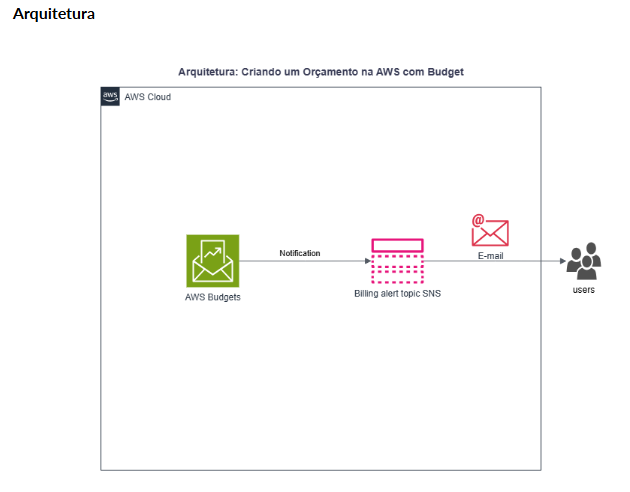
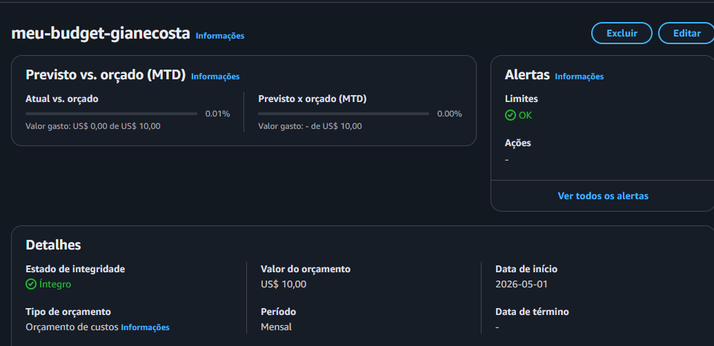

# Laboratório 02: Gestão de Custos com AWS Budgets

## 📝 Descrição do Projeto
Este laboratório teve como foco a implementação de boas práticas de **FinOps** e governança financeira na AWS. O objetivo principal foi configurar um mecanismo proativo de controle de custos para monitorar os gastos de uma conta de desenvolvimento, garantindo previsibilidade financeira e evitando surpresas ou faturamentos indesejados durante o período de aprendizado.

## 🗺️ Arquitetura de Notificação
O fluxo de monitoramento e alerta foi estruturado seguindo o modelo abaixo, utilizando o cruzamento de serviços de bilhetagem e mensageria da AWS:

* **AWS Budgets:** Monitora continuamente os custos reais acumulados na conta.
* **Amazon SNS (Simple Notification Service):** Dispara o tópico de notificação assim que o gatilho financeiro é atingido.
* **E-mail:** Canal final que entrega o alerta diretamente na caixa de entrada do administrador da conta.

## 🎯 Objetivos Concluídos
* Acesso e navegação pelo painel de gerenciamento de faturamento da AWS.
* Criação de um orçamento personalizado com teto limite de **US$ 10,00**.
* Configuração de uma regra de acionamento baseada em custo real (Gatilho de Alerta).
* Definição de um limite de alerta de **10% do valor orçado** (notificação disparada ao atingir US$ 1,00 de gasto).
* Vinculação de destinatários de e-mail para o recebimento de alertas automáticos.

## 🔍 Aprendizados e Conclusões
* **Cultura FinOps:** Entendi a diferença crucial entre a gestão de custos reativa (analisar a fatura apenas no fechamento do mês) e a proativa (configurar travas e alertas automáticos que avisam o time enquanto o gasto acontece).
* **Segurança Orçamentária:** Ferramentas de budget são o primeiro escudo de um desenvolvedor ou engenheiro de nuvem. Elas garantem que falhas de automação ou esquecimento de instâncias ligadas sejam detectadas rapidamente, protegendo a saúde financeira do projeto.

## 📸 Evidência de Sucesso (Painel de Orçamentos)
Abaixo está o registro do orçamento configurado e ativo na console da AWS, validando o teto orçamentário e as regras de controle aplicadas:

