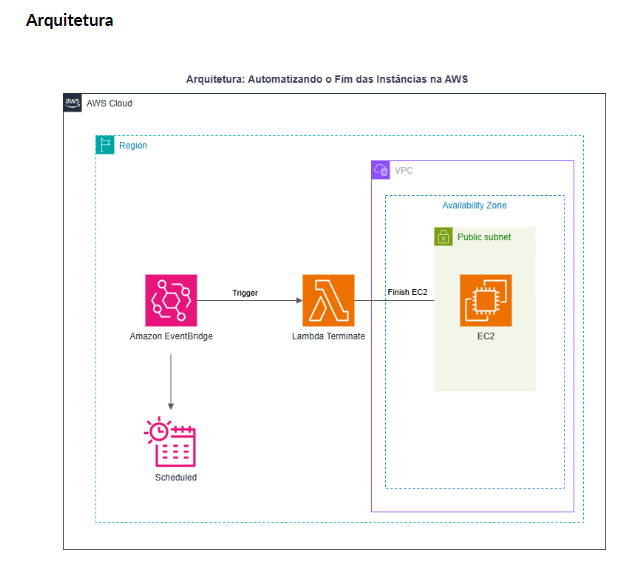
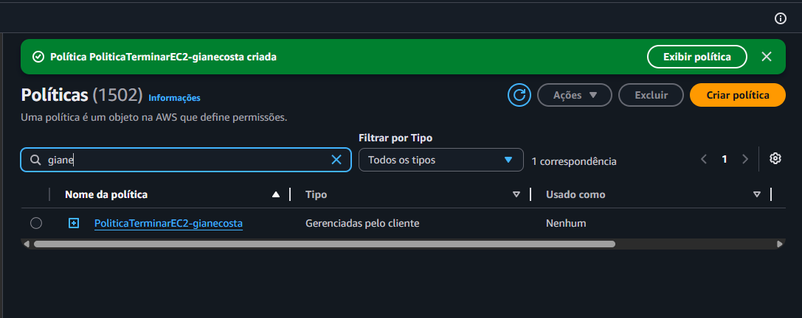
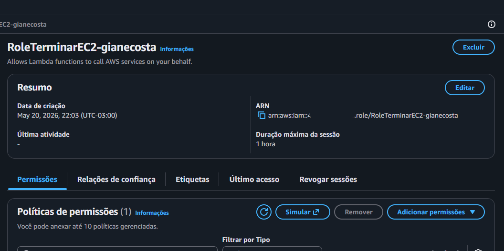
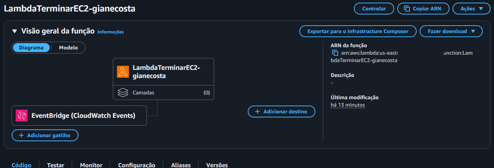
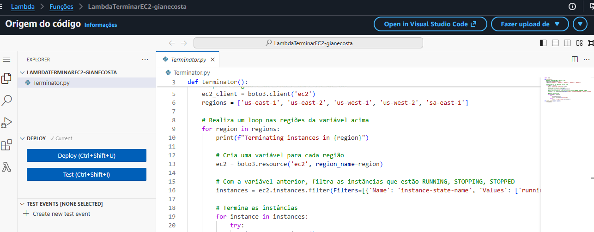

# Laboratório 03: Automação Serverless — Encerramento de Instâncias EC2

## 📝 Descrição do Projeto
Este laboratório prático focou na criação de uma arquitetura totalmente serverless e orientada a eventos para otimização de custos em nuvem. O objetivo principal foi desenvolver uma automação que identifica instâncias Amazon EC2 em execução e realiza o encerramento (*cleanup*) automático delas de forma programada, mitigando gastos desnecessários com recursos esquecidos ativos fora do horário operacional.

## 🗺️ Arquitetura do Sistema

O fluxo de execução segue o modelo de microsserviços integrados de forma nativa na AWS:

`Amazon EventBridge (Cronograma)` ➔ `Dispara Gatilho` ➔ `AWS Lambda (Python)` ➔ `Aplica Permissão IAM (Role)` ➔ `Amazon EC2 (Encerramento)`

---

## 📸 Evidências Técnicas do Projeto

### 1. Perímetro de Segurança: Política IAM Customizada
Configuração estrita seguindo o princípio do privilégio mínimo (*least privilege*), liberando apenas as chamadas necessárias para a automação listar e derrubar os servidores.

*Legenda: Print comprovando a criação da política IAM customizada, configurada estritamente com as permissões `ec2:DescribeInstances` e `ec2:TerminateInstances`. O nome da usuária (GianeCosta) está visível tanto no nome da política quanto na console.*

### 2. Identidade de Execução: Função IAM (Role)
Criação do perfil de segurança que permite ao serviço serverless assumir temporariamente os poderes de gerenciamento de infraestrutura.

*Legenda: Print validando a criação da Função IAM (Role) para execução do serviço AWS Lambda. A Role 'RoleTerminarEC2-GianeCosta' está vinculada com sucesso à política customizada criada anteriormente.*

### 3. Integração de Arquitetura: Gatilho EventBridge
Configuração do agendamento automatizado baseado em tempo por meio de expressões de programação.

*Legenda: Visão geral da arquitetura serverless no console da AWS Lambda. O print comprova a vinculação bem-sucedida do Amazon EventBridge (CloudWatch Events) como gatilho de execução automatizada para a função LambdaTerminarEC2-gianecosta.*

### 4. Inteligência da Automação: Código AWS Lambda em Python
Desenvolvimento do script em Python utilizando o SDK oficial `boto3` para varrer as regiões de infraestrutura e orquestrar o desligamento.

*Legenda: Print final validando a criação da função AWS Lambda serverless. O ecrã confirma o nome da função (LambdaTerminarEC2-gianecosta), o código Python com a lógica 'Terminator.py' e as regiões AWS configuradas, pronto para execução automática.*

---

## 🎯 Objetivos Concluídos e Aprendizados
* **Desenvolvimento com Boto3:** Criação de scripts em Python para manipulação direta de infraestrutura como código (IaC).
* **Arquitetura Orientada a Eventos:** Uso prático do Amazon EventBridge para agendar execuções automatizadas sem a necessidade de manter servidores de cron ativos.
* **Governança e IAM:** Compreensão profunda de políticas JSON de segurança e papeis de execução para isolamento de privilégios entre serviços.