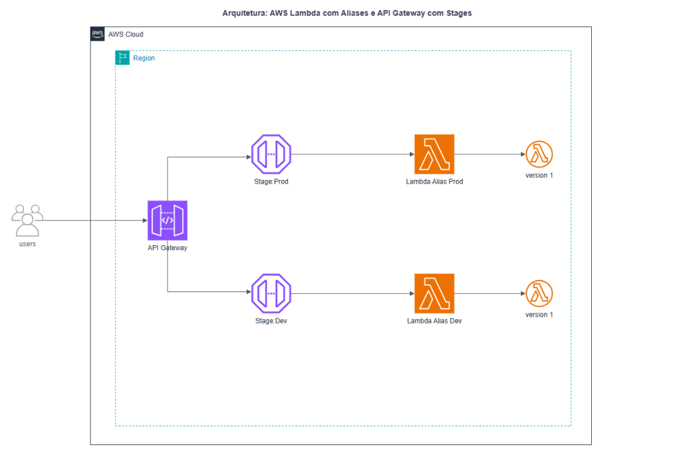

# ☁️ Lab: Gerenciamento de Ambientes Serverless com AWS Lambda (Aliases) e API Gateway (Stages)

## 🎯 Objetivo do Projeto
Este laboratório documenta a implementação de uma arquitetura serverless organizada e segura para o gerenciamento de múltiplos ambientes (como Desenvolvimento e Produção) na AWS. O foco principal foi criar endpoints estáveis no API Gateway que direcionam o tráfego de forma inteligente para versões específicas do código no AWS Lambda utilizando Aliases, eliminando a necessidade de duplicar funções ou APIs para cada ambiente.

---

## 🗺️ Arquitetura do Sistema

O fluxo de execução segue o modelo de microsserviços integrados de forma nativa na AWS:

`Cliente (Navegador)` ➔ `Requisição HTTP` ➔ `Amazon API Gateway (Stages)` ➔ `Integração Proxy` ➔ `AWS Lambda (Aliases/Python 3.13)` ➔ `Retorno JSON`

### 🔄 Detalhes do Fluxo de Requisições:
1. **Clientes (Navegador/Client):** Realizam requisições HTTP GET para os endpoints da API.
2. **Roteamento por Estágios (API Gateway Stages):** O API Gateway expõe URLs distintas para cada ambiente (`/Desenvolvimento` e `/Producao`).
3. **Integração via Proxy (Lambda Proxy Integration):** O API Gateway intercepta a chamada e repassa o objeto de evento completo de forma transparente para o backend.
4. **Ponteiros de Versão (Lambda Aliases):** Cada estágio do API Gateway está acoplado a um Alias específico da Lambda (`:dev` ou `:prod`). O Alias atua como um ponteiro estático que invoca a versão imutável correspondente do código (Versão 1 ou Versão 2).

---

## 🛠️ Tecnologias e Recursos Explorados
* **AWS Lambda:** Criação de funções utilizando o runtime **Python 3.13** e configuração de papéis de execução (IAM Execution Roles).
* **Versionamento do Lambda:** Publicação de versões imutáveis para garantir previsibilidade e estabilidade do código em produção.
* **Lambda Aliases:** Criação de aliases (`dev` e `prod`) servindo como ponteiros dinâmicos para versões específicas da função.
* **Amazon API Gateway (REST API):** Criação de recursos (`/hello`) e métodos HTTP (`GET`) configurados com Integração Proxy do Lambda.
* **API Gateway Stages:** Implantação e gerenciamento de múltiplos estágios para isolamento lógico de ambientes.

---

## ⚙️ Passo a Passo da Implementação

* **Passo 1:** Criação da função Lambda base utilizando Python 3.13.
* **Passo 2:** Publicação do código inicial (Mensagem de Desenvolvimento) como **Versão 1** e criação do Alias `dev` apontando para ela.
* **Passo 3:** Atualização do código (Mensagem de Produção), deploy no ambiente `$LATEST`, publicação da **Versão 2** e criação do Alias `prod`.
* **Passo 4:** Criação de uma API REST Regional no Amazon API Gateway com o recurso `/hello` e método `GET`.
* **Passo 5:** Configuração do método utilizando o ARN do Alias `dev` do Lambda e implantação no novo estágio chamado `Desenvolvimento`.
* **Passo 6:** Edição da solicitação de integração do método para apontar para o ARN do Alias `prod` do Lambda e implantação no novo estágio chamado `Producao`.

---

## 🧪 Validação e Testes Práticos
Para comprovar o correto direcionamento do tráfego e o isolamento dos ambientes, os endpoints fornecidos pelo API Gateway foram testados via navegador:
* **Teste no Estágio de Desenvolvimento:** A URL de invocação do stage `/Desenvolvimento` retornou o payload JSON com sucesso, exibindo a mensagem: `"message": "Ola do ambiente Desenvolvimento!"` e confirmando a execução da `functionVersion: 1` através do `functionAlias: dev`.
* **Teste no Estágio de Produção:** A URL de invocação do stage `/Producao` retornou com sucesso a resposta de produção: `"message": "Ola do ambiente de Producao!"` correspondente à `functionVersion: 2` através do `functionAlias: prod`.

---

## 🎓 Foco na Certificação AWS Developer (DVA-C02)
Este laboratório fixou conceitos fundamentais cobrados com alta frequência no exame DVA-C02:
* **Lambda Proxy Integration:** Compreensão de como o API Gateway passa os metadados da requisição (`requestContext.stage`) para dentro do dicionário `event` da Lambda.
* **Imutabilidade de Versões:** Entendimento de que uma versão publicada do Lambda não pode ser alterada, garantindo a integridade do ambiente produtivo.
* **Roteamento de Tráfego por Alias:** Como utilizar aliases para simplificar o pipeline de CI/CD, permitindo atualizar o ponteiro de uma versão sem modificar as configurações do API Gateway.
* **Separação de Ambientes Baseada em Estágios:** Melhores práticas para gerenciar variáveis de estágio e implantações controladas no API Gateway.

---

## 👩‍💻 Autor
Laboratório executado por [Giane Costa](https://www.linkedin.com/in/giane-costa/).