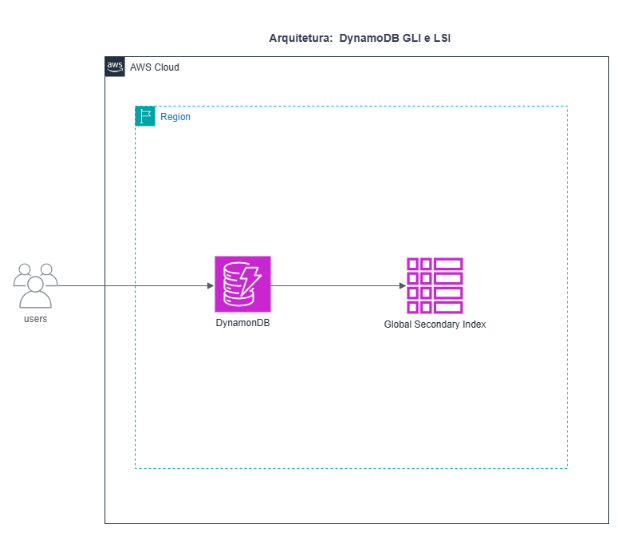
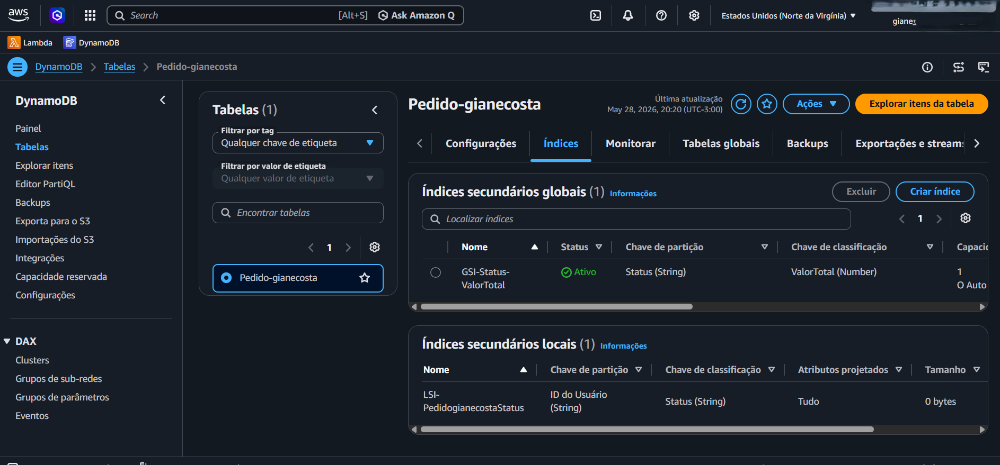

# Laboratório 04: Modelagem NoSQL e Otimização de Consultas com Amazon DynamoDB

## 📝 Descrição do Projeto
Este laboratório prático teve como foco o desenho de tabelas NoSQL eficientes e a otimização de consultas utilizando o Amazon DynamoDB. O cenário envolveu o provisionamento de uma tabela de pedidos para uma empresa fictícia, a criação de Índices Secundários Locais (LSI) e Globais (GSI) para viabilizar diferentes padrões de busca, e a ingestão automatizada de dados em lote (batch) através da interface nativa do console da AWS.

## 🎯 Objetivos Concluídos
* **Modelagem Base:** Criação da tabela principal `Pedido-gianecosta` com chave de partição (`ID do Usuário`) e chave de classificação (`Data do Pedido`).
* **Índice Secundário Local (LSI):** Criação de um LSI (`LSI-PedidogianecostaStatus`) utilizando a mesma chave de partição, mas alterando a chave de classificação para o campo `Status`.
* **Índice Secundário Global (GSI):** Criação de um GSI (`GSI-Status-ValorTotal`) invertendo a estrutura de busca, utilizando `Status` as chave de partição e `ValorTotal` como chave de classificação.
* **Ingestão em Lote:** Importação automatizada de múltiplos registros no formato JSON diretamente pela console web do Amazon DynamoDB.
* **Análise de Performance:** Comparação prática de eficiência entre operações de varredura completa (Scan) e consultas direcionadas (Query).

## 📥 Manipulação e Ingestão de Dados
Para povoar a tabela de forma eficiente e simular um cenário real de volume de dados, o processo foi executado em duas etapas complementares:

1. **Gerenciamento de Arquivos via AWS CloudShell:** Utilizou-se o terminal interativo para baixar, validar e inspecionar o arquivo estruturado de dados (`pedidos_import.json`) diretamente no ambiente de linha de comando da AWS.
2. **Carga em Lote via Console do DynamoDB:** Com o arquivo preparado, realizou-se a importação automatizada de múltiplos registros de forma nativa pela interface gráfica do Amazon DynamoDB, consolidando a carga em lote (*Batch Write*) com sucesso.

## 🔍 Aprendizados e Conclusões
* **Query vs. Scan (Custo e Eficiência):** Ficou evidente a diferença drástica de performance entre os métodos. Enquanto o Scan percorre toda a tabela gerando uma eficiência baixa (consumindo mais RCU), a operação de Query atinge 100% de eficiência por buscar direto nas chaves indexadas, o que reduz custos operacionais críticos em ambientes de produção.
* **Flexibilidade com LSI e GSI:** Entendi o poder de flexibilizar o acesso aos dados em bancos NoSQL. O LSI permitiu buscar pedidos de um usuário específico filtrando pelo status da entrega, enquanto o GSI quebrou as fronteiras da chave de partição original, permitindo buscar de forma global todos os pedidos do sistema que possuem um determinado status e valor financeiro.
* **Gerenciamento e Clean-up:** Fixação do fluxo de exclusão de recursos do DynamoDB (remover GSIs e alarmes do CloudWatch antes de deletar a tabela principal) para garantir a governança e evitar custos residuais (FinOps).

## 🚀 Próximos Passos (Sugestões de Evolução)
Como melhorias futuras para este desenho de arquitetura, podem ser aplicados os seguintes conceitos:
1. Implementar o DynamoDB Streams integrado a uma função AWS Lambda para disparar notificações em tempo real sempre que um pedido mudar de status.
2. Habilitar e testar o comportamento do cache em memória utilizando o Amazon DAX (DynamoDB Accelerator) para leituras de altíssima performance.
3. Desenvolver uma API REST in Python (FastAPI/Boto3) para expor esses padrões de consulta de forma segura.

## 📸 Evidências de Sucesso

### 1. Consolidação da Infraestrutura: Tabela, LSI e GSI
Painel centralizado do Amazon DynamoDB comprovando o sucesso no provisionamento da arquitetura NoSQL. Em uma única visualização, valida-se a ativação da tabela principal `Pedido-gianecosta`, o Índice Secundário Global (`GSI-Status-ValorTotal`) e o Índice Secundário Local (`LSI-PedidogianecostaStatus`) com suas respectivas chaves e tipos de dados perfeitamente mapeados.

