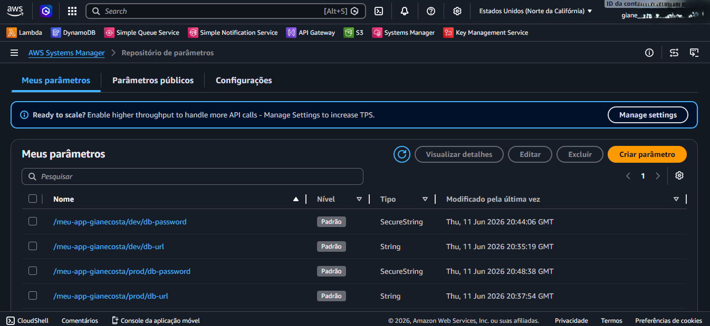
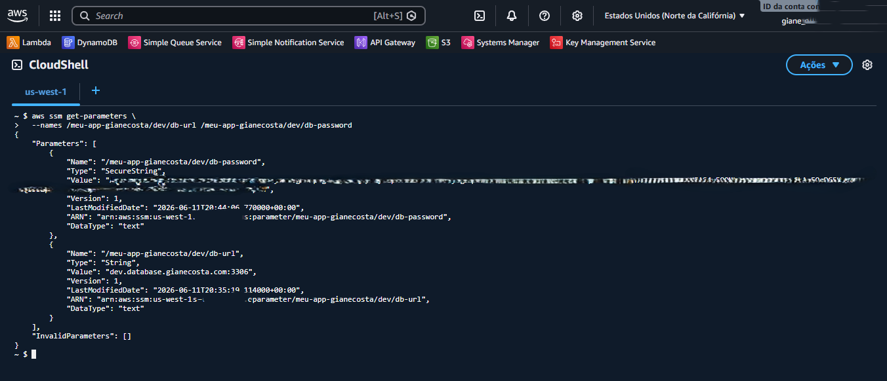
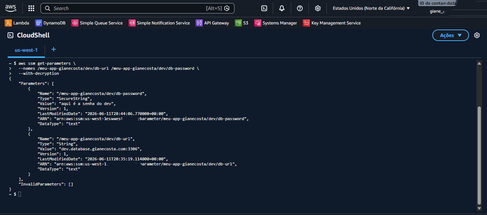
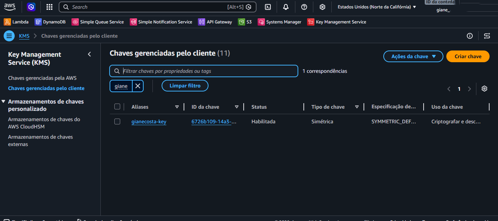

# Laboratório 08: Gerenciamento Centralizado de Segredos e Criptografia em Repouso com AWS SSM Parameter Store e KMS

## 📝 Descrição do Projeto
Este laboratório prático teve como foco a implementação de práticas avançadas de DevSecOps e segurança arquitetural na nuvem AWS. O cenário envolveu a descentralização de variáveis de ambiente e dados sensíveis do código-fonte da aplicação (*hardcoded*), armazenando-os de forma segura no **AWS Systems Manager (SSM) Parameter Store**. Para garantir a proteção de dados confidenciais (`SecureString`) ao nível de disco (criptografia em repouso), criou-se uma chave de criptografia customizada e simétrica no **AWS Key Management Service (KMS)**. Por fim, toda a estrutura de governança e consumo foi validada via linha de comando através da AWS CLI no **AWS CloudShell**.

## 🎯 Objetivos Concluídos
* **Estrutura Hierárquica:** Criação de parâmetros organizados por escopo e ambiente utilizando caminhos lógicos (ex: `/meu-app-gianecosta/dev/` e `/meu-app-gianecosta/prod/`).
* **Diferenciação de Tipos:** Configuração de parâmetros comuns utilizando o tipo `String` (para URLs de banco de dados) e dados confidenciais utilizando o tipo `SecureString` (para credenciais de acesso).
* **Chave Customizada (CMK):** Criação e gerenciamento de uma chave de criptografia simétrica customizada no AWS KMS identificada pelo alias `gianecosta-key`.
* **Consumo Seguro via CLI:** Validação prática do consumo de parâmetros através do terminal do CloudShell, comparando o comportamento do retorno com e sem a flag de descriptografia.
* **Cultura FinOps:** Aplicação das boas práticas de ciclo de vida e limpeza de recursos, programando o agendamento de exclusão da chave KMS para evitar custos residuais.

## 📥 Fluxo de Implementação e Consumo
O laboratório foi executado seguindo três etapas complementares de engenharia de segurança:

1. **Provisionamento da Chave KMS:** Criação de uma chave gerenciada pelo cliente (CMK) simétrica, definindo políticas de uso restritas para garantir o princípio do privilégio mínimo.
2. **Centralização no Parameter Store:** Cadastro das variáveis de ambiente organizadas por pastas lógicas. Ao mapear a senha como `SecureString`, o SSM realizou uma chamada nativa de API ao KMS, gravando o dado no disco rígido de forma totalmente criptografada.
3. **Validação e Auditoria:** Utilizando a AWS CLI, executou-se a consulta dos dados. Sem a flag `--with-decryption`, a AWS barrou o acesso e entregou o valor em formato *Ciphertext* (criptografado). Ao aplicar a flag de descriptografia, o ecossistema validou as permissões e expôs com sucesso o valor em texto claro na memória RAM do terminal.

## 🧠 Aprendizados e Conclusões
* **Mitigação de Riscos (Anti-Hardcoded):** Compreensão prática de que senhas e credenciais nunca devem residir dentro do código-fonte ou em arquivos expostos. O desacoplamento eleva o nível de segurança e facilita integrações automáticas em esteiras de CI/CD.
* **Criptografia em Repouso (Encryption at Rest):** Fixação do conceito de que dados salvos em disco precisam estar protegidos. Mesmo se um atacante obter acesso físico ou lógico ao armazenamento bruto da nuvem, o dado cifrado (`AQICAHg9B...`) torna-se completamente inútil sem a respectiva chave criptográfica.
* **Princípio do Privilégio Mínimo:** Entendi que a segurança em camadas exige dupla autorização. Uma identidade que consiga ler o Parameter Store só verá o segredo real se também tiver permissão explícita para utilizar a chave decodificadora do KMS.
* **Ciclo de Vida de Recursos:** Entendimento do status de segurança *Pending deletion* do KMS. O período de carência serve como um mecanismo de segurança crítico para evitar que uma deleção acidental quebre sistemas de produção de forma irreversível.

## 🚀 Próximos Passos (Sugestões de Evolução)
Como melhorias e desdobramentos futuros a partir deste laboratório, podem ser aplicados:
1. Desenvolver um script em **Python (utilizando a biblioteca Boto3)** para ler esses parâmetros automaticamente e injetá-los na memória de uma aplicação sem a necessidade de arquivos locais `.env`.
2. Integrar o consumo desses parâmetros seguros em uma função AWS Lambda de backend.
3. Migrar credenciais que exigem rotação automática (como senhas de banco de dados rotativas) para o **AWS Secrets Manager**, avaliando a diferença de custo e caso de uso frente ao Parameter Store.

---

## 📸 Evidências de Sucesso

### 1. Parâmetros Configurados no Systems Manager
Painel do AWS Systems Manager demonstrando o repositório de parâmetros devidamente povoado com a estrutura hierárquica dividida entre os ambientes de Desenvolvimento (`/dev`) e Produção (`/prod`), mapeando corretamente os tipos `String` e `SecureString`.

### 2. Chamada de API Segura (Camada de Proteção)
Consulta realizada via AWS CLI no terminal do CloudShell demonstrando a eficácia da criptografia. Ao solicitar os dados sem a instrução de descriptografia, o Parameter Store protege a credencial sensível entregando o valor em formato *Ciphertext*.

### 3. Consumo com Descriptografia Prática (Sucesso do Lab)
Execução bem-sucedida do comando utilizando a flag `--with-decryption`. O terminal aciona o KMS em background, realiza a decodificação autorizada e expõe o parâmetro em texto claro pronto para o consumo do sistema.

### 4. Governança da Chave Customizada no AWS KMS
Evidência visual do console do AWS Key Management Service (KMS) exibindo a chave simétrica gerenciada pelo cliente criada para este escopo, validada através do alias `gianecosta-key` com o status operacional ativo no momento dos testes.

