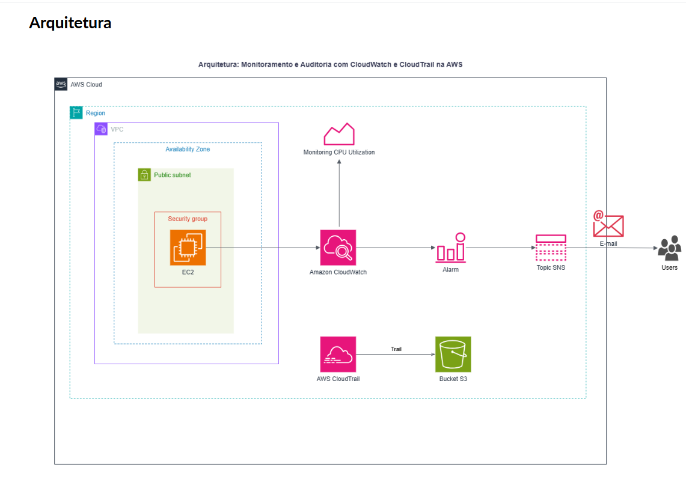
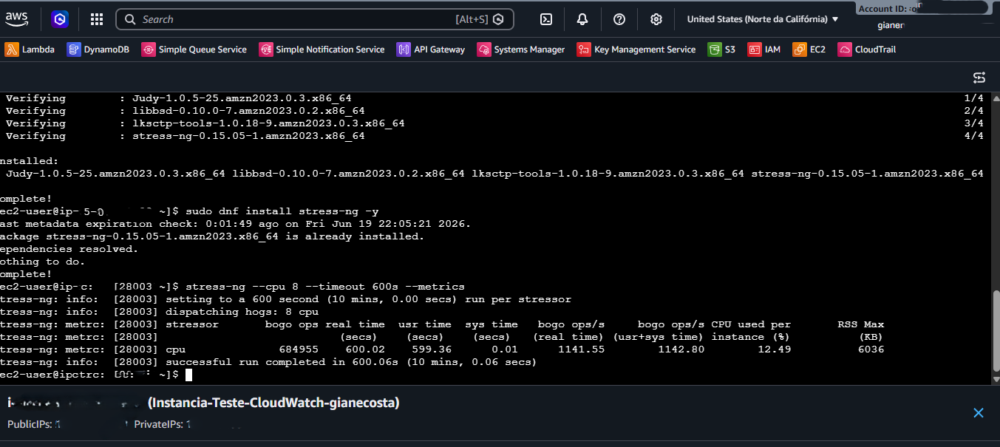
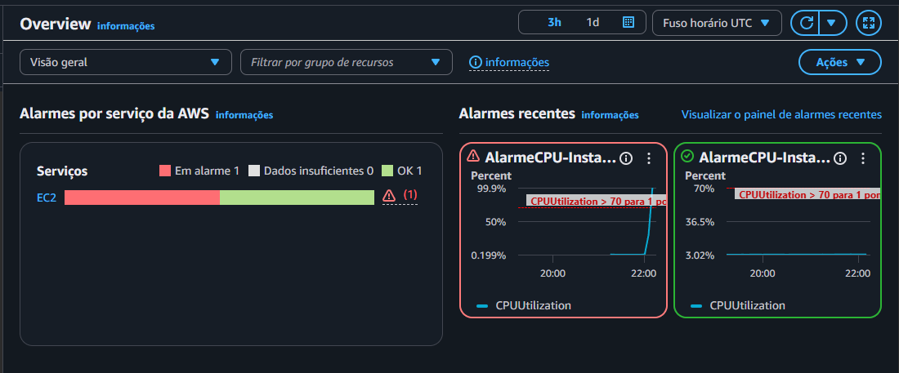
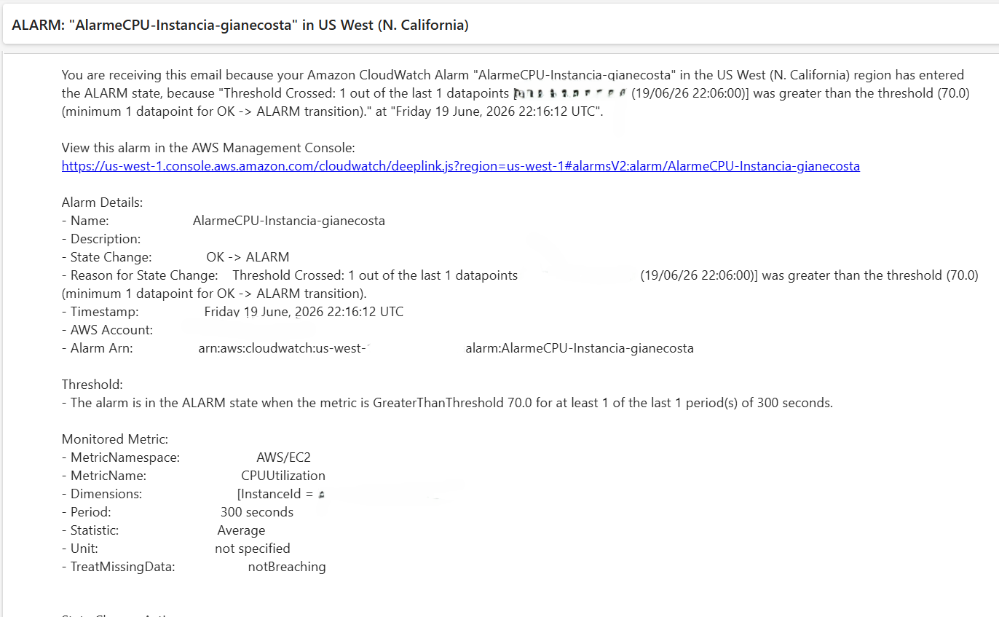
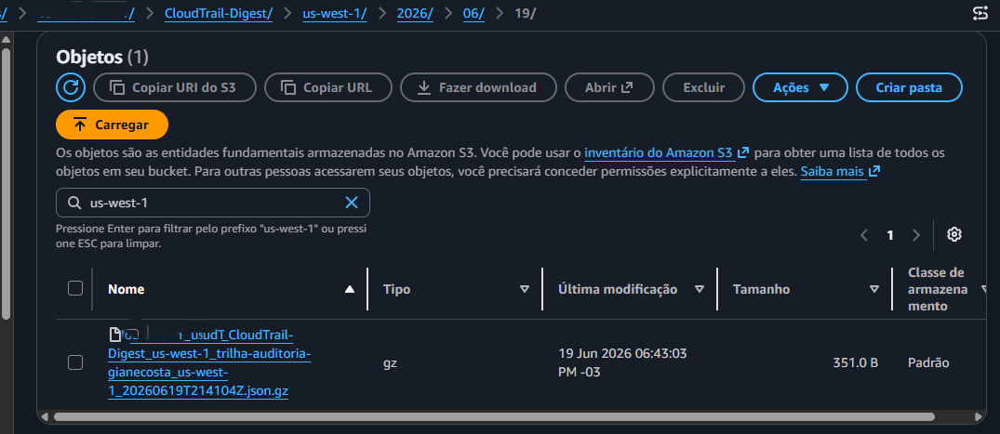

# Laboratório 09: Observabilidade, Auditoria e Governança com Amazon CloudWatch, AWS CloudTrail e Amazon SNS

## 📝 Descrição do Projeto
Este laboratório prático teve como foco a implementação de uma arquitetura resiliente de monitoramento, auditoria de segurança e governança de infraestrutura na nuvem AWS. O cenário envolveu o provisionamento de uma instância EC2 rodando Amazon Linux 2023, onde foi configurado um alarme do **Amazon CloudWatch** para monitorar a utilização de CPU. Para fins de auditoria e conformidade (*compliance*), habilitou-se o rastreamento global de atividades de API da conta através do **AWS CloudTrail**, direcionando os registros de forma segura para um bucket **Amazon S3** e centralizando-os no **CloudWatch Logs**. O ecossistema também contou com o acoplamento do **Amazon SNS** para o disparo de notificações reativas via e-mail.

## 🏗️ Arquitetura do Projeto

O fluxo de monitoramento e auditoria da infraestrutura segue os seguintes passos:
1. **Amazon EC2:** Servidor virtual rodando Amazon Linux 2023, que serve como base da nossa aplicação.
2. **Amazon CloudWatch Alarms:** Monitora a métrica de `CPUUtilization` da instância. Caso o uso ultrapasse 70% por 5 minutos, o alarme é disparado.
3. **Amazon SNS:** Recebe o gatilho do alarme e encaminha uma notificação de alerta por e-mail em tempo real.
4. **AWS CloudTrail:** Registra todas as atividades e chamadas de API da conta para fins de governança e segurança.
5. **Amazon S3:** Armazena os logs de auditoria criptografados (`.json.gz`) gerados pelo CloudTrail.

## 🎯 Objetivos Concluídos
* **Monitoramento de Performance:** Configuração de alarme estático no CloudWatch para validar picos de processamento (`CPUUtilization > 70%`) em períodos de 5 minutos.
* **Mensageria e Notificações:** Criação e assinatura de um tópico no Amazon SNS para o envio de alertas automatizados de infraestrutura direto para o e-mail do administrador.
* **Rastreamento de Trilha (Auditoria):** Ativação de uma trilha de auditoria (*Trail*) no CloudTrail com criptografia em repouso ativada via chave customizada no AWS KMS.
* **Injeção de Carga Estressante:** Instalação e execução do utilitário `stress-ng` via conexão remota para simular estresse severo de hardware e validar o comportamento do alarme.
* **Governança em Camadas:** Visualização, análise e extração de logs estruturados em formato JSON tanto na camada de armazenamento (S3) quanto na de indexação (CloudWatch Logs Groups).

## 🛠️ Execução Técnica e Teste de Estresse
O fluxo de teste para validação das ferramentas de monitoramento foi executado em três etapas consecutivas:

1. **Acesso Remoto e Preparação:** Conexão à instância via EC2 Instance Connect, seguida da atualização dos pacotes do sistema operacional através do gerenciador de pacotes nativo `dnf`.
2. **Simulação de Carga com Stress-NG:** Execução do comando de injeção de estresse em hardware simulando o consumo máximo de processamento por 10 minutos (600 segundos).
3. **Validação do Gatilho:** Análise do comportamento gráfico do CloudWatch até o estado transicionar de `OK` para `In alarm`, culminando com a auditoria do recebimento da mensagem no e-mail corporativo.

## 🧠 Aprendizados e Conclusões
* **Observabilidade Proativa vs. Reativa:** Entendi na prática a importância de estabelecer alarmes de métricas. Em ambientes de produção de ADS, monitorar proativamente gargalos de infraestrutura (como CPU ou memória) previne indisponibilidades severas no sistema.
* **Importância Crítica do CloudTrail:** A auditoria contínua de eventos de gerenciamento (Read/Write) garante que qualquer alteração de infraestrutura, chamada de API ou acesso indevido na conta fique registrado com rastreabilidade total (quem, quando e o que foi feito).
* **Desacoplamento de Alertas com SNS:** O uso do padrão de mensageria Pub/Sub via SNS permite que as notificações de infraestrutura cheguem instantaneamente aos times de SRE e Segurança sem que a aplicação ou o CloudWatch precisem gerenciar envios de e-mail de forma direta.

## 🚀 Próximos Passos (Sugestões de Evolução)
Como melhorias futuras para expandir este modelo de observabilidade, podem ser aplicados os seguintes conceitos:
1. Criar uma política de **Auto Scaling** integrada ao alarme do CloudWatch para provisionar novas instâncias EC2 automaticamente sempre que o consumo de CPU exceder o limite de segurança.
2. Configurar uma regra no **Amazon EventBridge** integrada a uma função AWS Lambda para realizar a remediação automática de segurança sempre que o CloudTrail detectar chamadas de API suspeitas ou não autorizadas.
3. Desenvolver um painel de visualização gráfica unificado (**CloudWatch Dashboard**) para monitorar múltiplas instâncias simultaneamente em tempo real.

---

## 📸 Evidências de Sucesso

### 1. Execução do Teste de Estresse na Instância EC2
Conexão via EC2 Instance Connect demonstrando a instalação e execução do utilitário `stress-ng`. O comando foi configurado para estressar 8 núcleos de CPU por 600 segundos, forçando a infraestrutura para validar os gatilhos de monitoramento.

### 2. Alarme CloudWatch Ativado (Status: Em Alarme)
Painel de alarmes do Amazon CloudWatch demonstrando o exato momento em que o limite estático de segurança foi violado pelo teste de estresse de CPU, transicionando o status para o modo crítico de alerta.

### 3. Notificação de Alerta Recebida via Amazon SNS
Comprovação de entrega de e-mail enviada pelo serviço de mensageria Amazon SNS, contendo o payload detalhado e os metadados brutos enviados pelo CloudWatch indicando a violação do limite.

### 4. Coleta de Logs Estruturados no Amazon S3
Navegação na estrutura interna de diretórios do bucket S3 demonstrando os arquivos JSON compactados gerados automaticamente pelo AWS CloudTrail, guardados de forma íntegra para fins de conformidade regulatória e governança.

