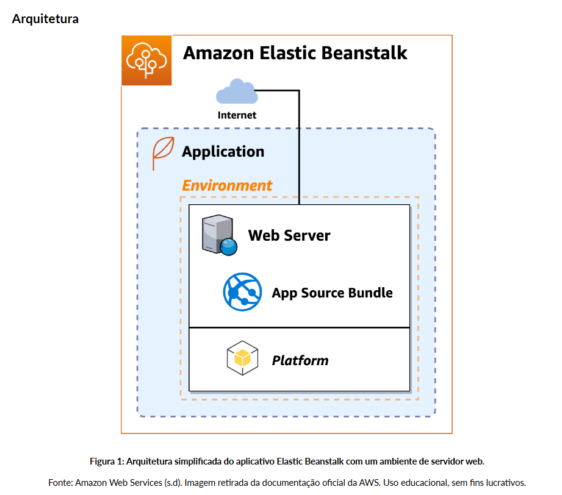
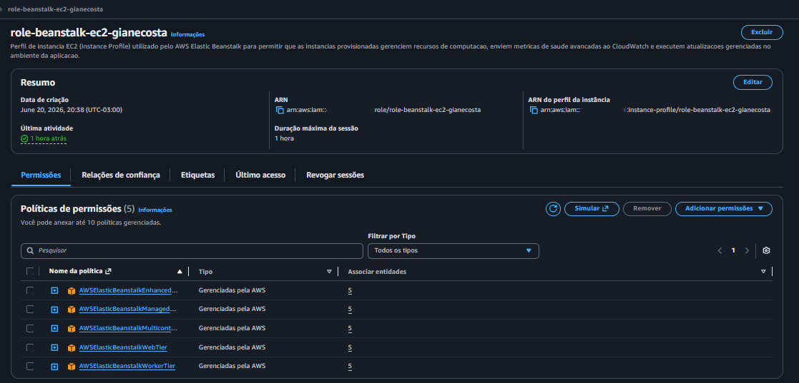
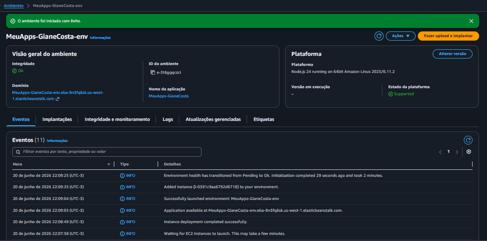
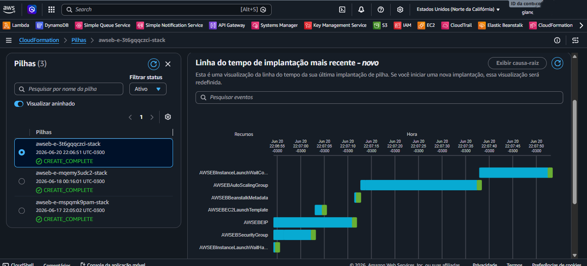
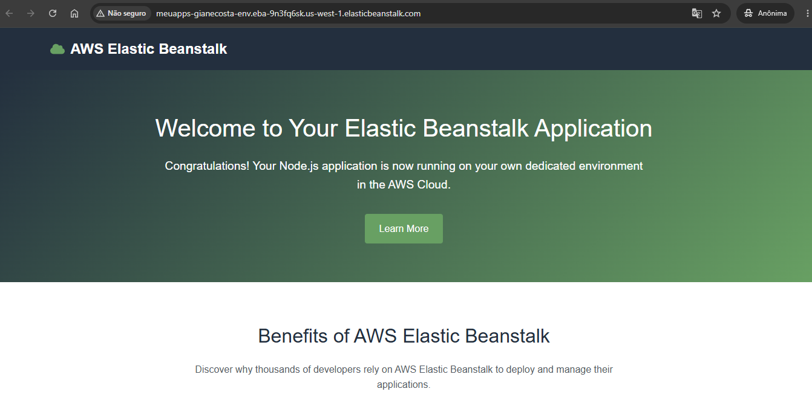

# AWS Elastic Beanstalk: Implantação e Orquestração Automatizada de Aplicações Web

## 📖 Descrição do Projeto
Este repositório documenta a implementação prática do **Laboratório 11** da trilha AWS Developer na Escola da Nuvem. O objetivo principal deste projeto foi utilizar o **AWS Elastic Beanstalk** para realizar a implantação automatizada de uma aplicação web (Node.js), gerenciando e abstraindo toda a infraestrutura subjacente de computação, escalabilidade e rede.

O projeto cobriu desde a criação e vinculação de perfis de instância baseados no princípio do privilégio mínimo (IAM) até a auditoria de recursos provisionados automaticamente via AWS CloudFormation.

---

## 🗺️ Arquitetura do Ambiente
Abaixo está o modelo estrutural do ambiente gerenciado pelo Elastic Beanstalk, ilustrando como o serviço isola o servidor web e orquestra os recursos de infraestrutura:

---

## 🛠️ Tecnologias e Serviços Utilizados
* **AWS Elastic Beanstalk:** Provisionamento e gerenciamento simplificado da aplicação em modelo PaaS.
* **AWS IAM (Identity and Access Management):** Criação de perfil de instância EC2 (Instance Profile) com permissões granulares.
* **Amazon EC2:** Infraestrutura de computação utilizada para hospedar a aplicação Node.js.
* **AWS CloudFormation:** Mecanismo subjacente que orquestrou a stack de infraestrutura como código (IaC).
* **Node.js:** Runtime da aplicação web de exemplo utilizada na demonstração.

---

## 🚀 Arquitetura e Fluxo de Implementação

### Fase 1: Perfil de Instância IAM
Para permitir que as instâncias EC2 gerenciadas pelo Beanstalk interajam com os serviços de telemetria, gerenciamento e armazenamento da AWS de forma segura, foi criada uma Role IAM customizada (`role-beanstalk-ec2-giane-costa`) contendo as seguintes 5 políticas gerenciadas pela AWS:
* `AWSElasticBeanstalkWebTier` (Para ambientes Web Server)
* `AWSElasticBeanstalkWorkerTier` (Para Worker Tiers)
* `AWSElasticBeanstalkMulticontainerDocker` (Para cenários com Multi-container Docker)
* `AWSElasticBeanstalkEnhancedHealth` (Essencial para relatórios de saúde detalhados)
* `AWSElasticBeanstalkManagedUpdatesCustomerRolePolicy` (Para a política de atualizações gerenciadas)

### Fase 2: Provisionamento do Ambiente
Através do console do Elastic Beanstalk, foi configurada uma aplicação com predefinição de **Instância Única (Single Instance)** para controle de custos, apontando para a aplicação de exemplo oficial em Node.js. O Beanstalk vinculou o Perfil de Instância criado e disparou de forma totalmente automatizada a stack do CloudFormation correspondente.

---

## 📸 Evidências do Laboratório 

### 1. Criação do Perfil de Instância (EC2 Instance Profile)
Evidência da Role IAM criada especificamente para o ciclo de vida das instâncias do Elastic Beanstalk, detalhando as permissões granulares anexadas para auditoria e saúde do ambiente.

### 2. Ambiente Elastic Beanstalk Ativo e Funcional
Evidência do painel centralizado do Elastic Beanstalk mostrando o status de saúde verde ("Health: OK") do ambiente `MeuApps-Gianecosta-env`, validando o provisionamento correto da aplicação web.

### 3. Orquestração da Stack via AWS CloudFormation
Evidência dos bastidores do provisionamento, mostrando a linha do tempo de criação ordenada de todos os recursos de infraestrutura (Security Groups, EC2 e IPs Elásticos) gerenciados de forma automatizada.

### 4. Aplicação Node.js em Execução
Evidência da aplicação de exemplo do Elastic Beanstalk respondendo com sucesso em ambiente público de produção.

---

## 🔬 Aprendizados em Destaque
* **Abstração de Infraestrutura:** Compreensão prática de como o Elastic Beanstalk otimiza o tempo de go-to-market ao assumir a responsabilidade pelo provisionamento de capacidade, balanceamento de carga e escalabilidade automática, permitindo que a equipe foque apenas no código.
* **Governança com IAM:** Aplicação correta de perfis de instância do EC2 para isolamento de segurança em ambientes gerenciados automaticamente.
* **Ciclo de Vida de Aplicações:** Exploração de recursos pós-implantação como coleta de logs centralizada, monitoramento de métricas via CloudWatch e estratégias de atualizações gerenciadas (Managed Updates).