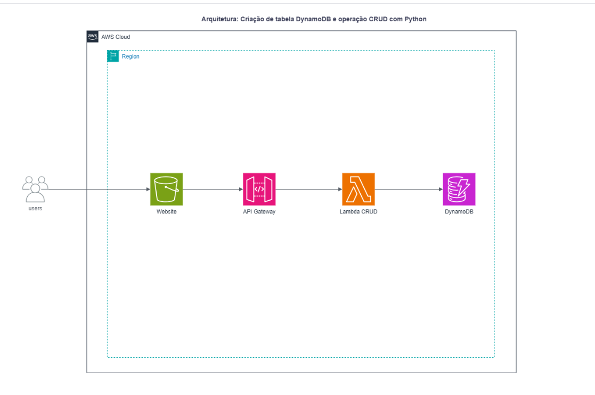
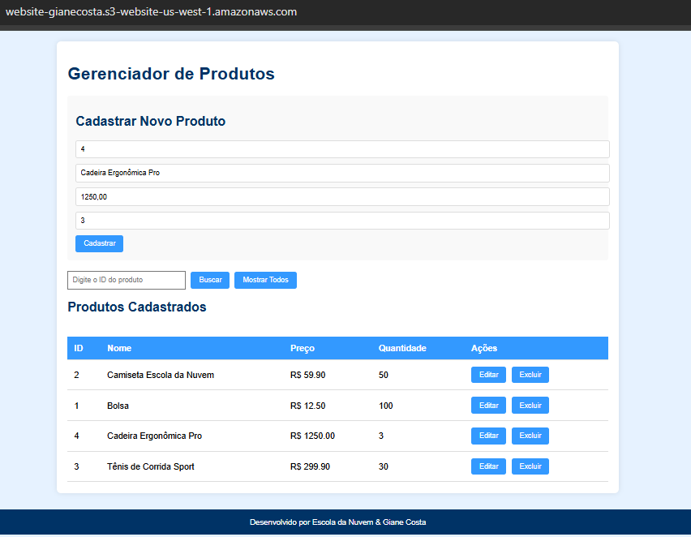
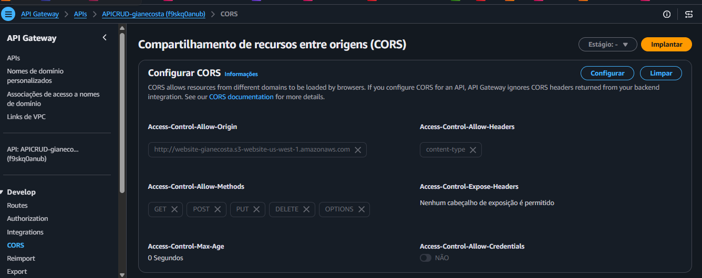
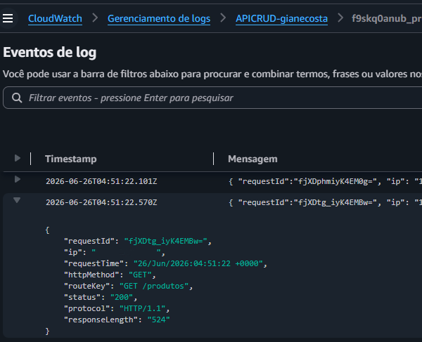
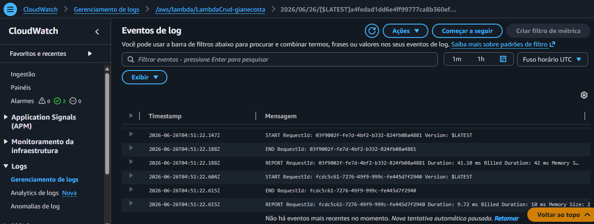

# Laboratório 13 - Aplicação Web Serverless CRUD com DynamoDB e Python

## 📋 Descrição do Projeto
Este repositório contém os artefatos e a documentação do **Laboratório 13** da trilha AWS Developer na Escola da Nuvem. O objetivo prático foi construir uma aplicação web full-stack **100% Serverless** para gerenciamento e cadastro de produtos.

A solução utiliza uma interface estática (Frontend) hospedada de forma segura e econômica no **Amazon S3**, que realiza chamadas HTTP assíncronas para um endpoint do **Amazon API Gateway**. A API encaminha as requisições para uma função **AWS Lambda** desenvolvida em **Python 3.12**, responsável por executar as operações de **CRUD** (Create, Read, Update, Delete) diretamente em uma tabela NoSQL do **Amazon DynamoDB**. Toda a camada de monitoramento e auditoria de acessos foi centralizada no **Amazon CloudWatch Logs**.

---


## 🏗️ Arquitetura da Solução

 

* **Camada de Apresentação (Frontend):** Interface web (HTML5, CSS3, JavaScript) hospedada em um Bucket do Amazon S3 configurado para Static Website Hosting.

* **Camada de Apresentação (Frontend):** Interface web (HTML5, CSS3, JavaScript) hospedada em um Bucket do Amazon S3 configurado para Static Website Hosting.
* **Camada de Roteamento (API Management):** Amazon API Gateway (HTTP API) configurado com regras de CORS e integração direta com a Lambda.
* **Camada de Processamento (Backend):** AWS Lambda executando Python 3.12 com o SDK `boto3` para orquestração da lógica de negócio.
* **Camada de Persistência (Banco de Dados):** Amazon DynamoDB atuando como banco NoSQL chave-valor de alta performance.
* **Camada de Observabilidade:** Grupos de Logs customizados no Amazon CloudWatch para rastreamento de acessos da API e execuções da Lambda.

---

## 🛠️ Rotas da API e Operações CRUD

A API foi estruturada utilizando rotas HTTP específicas integradas à mesma função Lambda controladora:

| Método HTTP | Caminho do Recurso | Operação CRUD | Descrição |
| :--- | :--- | :--- | :--- |
| **POST** | `/produtos` | **Create** | Cadastra um novo produto no DynamoDB |
| **GET** | `/produtos` | **Read (List)** | Lista todos os produtos armazenados |
| **GET** | `/produtos/{id}` | **Read (Detail)**| Obtém detalhes de um produto específico |
| **PUT** | `/produtos/{id}` | **Update** | Atualiza os dados de um produto existente |
| **DELETE**| `/produtos/{id}` | **Delete** | Remove um produto do banco de dados |

---

## 📜 Código do Backend (AWS Lambda - Python 3.12)

A função Lambda foi configurada com o manipulador ajustado para `CRUD.lambda_handler`, contando com **256 MB de memória** e **10 segundos de Timeout** para garantir resiliência.

<details>
<summary><b>💻 Ver código-fonte do Backend (CRUD.py)</b></summary>

```python
import json
import boto3
from decimal import Decimal
from datetime import datetime

dynamodb = boto3.resource('dynamodb')
table = dynamodb.Table('<Sua tabela Dynamondb>')

def convert_decimals(obj):
    if isinstance(obj, Decimal):
        return float(obj)
    if isinstance(obj, dict):
        return {k: convert_decimals(v) for k, v in obj.items()}
    if isinstance(obj, list):
        return [convert_decimals(v) for v in obj]
    return obj

def respond(status_code, body):
    return {
        'statusCode': status_code,
        'headers': {
            'Content-Type': 'application/json',
            'Access-Control-Allow-Origin': '*',
            'Access-Control-Allow-Methods': 'GET,POST,PUT,DELETE,OPTIONS',
            'Access-Control-Allow-Headers': '*'
        },
        'body': json.dumps(convert_decimals(body), default=str)
    }

def lambda_handler(event, context):
    http_method = event['requestContext']['http']['method']
    path = event['rawPath'].replace('/prod', '', 1)
    
    # OPTIONS (CORS preflight)
    if http_method == 'OPTIONS':
        return respond(200, {})

    # POST /produtos
    if http_method == 'POST' and path == '/produtos':
        body = json.loads(event.get('body') or '{}')
        for f in ('id','nome','preco','quantidade'):
            if f not in body:
                return respond(400, {'erro': f'{f} é obrigatório'})
        if table.get_item(Key={'id': body['id']}).get('Item'):
            return respond(409, {'erro': f"ID {body['id']} já existe"})
        item = {
            'id': body['id'],
            'nome': body['nome'],
            'preco': Decimal(str(body['preco'])),
            'quantidade': int(body['quantidade']),
            'data_criacao': datetime.utcnow().isoformat()
        }
        table.put_item(Item=item)
        return respond(201, {'mensagem':'Produto criado','dados':item})

    # GET /produtos
    if http_method == 'GET' and path == '/produtos':
        resp = table.scan()
        return respond(200, {'produtos': resp.get('Items', [])})

    # GET /produtos/{id}
    if http_method == 'GET' and path.startswith('/produtos/'):
        pid = event['pathParameters']['id']
        resp = table.get_item(Key={'id': pid})
        if 'Item' not in resp:
            return respond(404, {'erro':'Produto não encontrado'})
        return respond(200, resp['Item'])

    # PUT /produtos/{id}
    if http_method == 'PUT' and path.startswith('/produtos/'):
        pid = event['pathParameters']['id']
        body = json.loads(event.get('body') or '{}')
        upds, vals = [], {}
        for k,v in body.items():
            if k in ('nome','preco','quantidade'):
                upds.append(f"{k}=:{k}")
                vals[f":{k}"] = Decimal(str(v)) if k=='preco' else (int(v) if k=='quantidade' else v)
        if not upds:
            return respond(400, {'erro':'Nenhum campo válido para atualizar'})
        resp = table.update_item(
            Key={'id': pid},
            UpdateExpression='SET ' + ','.join(upds),
            ExpressionAttributeValues=vals,
            ReturnValues='ALL_NEW'
        )
        return respond(200, resp['Attributes'])

    # DELETE /produtos/{id}
    if http_method == 'DELETE' and path.startswith('/produtos/'):
        pid = event['pathParameters']['id']
        table.delete_item(Key={'id': pid})
        return respond(200, {'mensagem':'Produto excluído'})

    return respond(400, {'erro':'Método ou rota não suportada'})
```
</details>

## 🧪 Dados para Teste de Carga Inicial

Utilize os dados abaixo na interface web para validar o comportamento do CRUD e popular a tabela do DynamoDB:

| ID do Produto | Nome do Produto | Preço (Number/Float) | Quantidade (Int) |
| :---: | :--- | :---: | :---: |
| **1** | Bolsa | `12.50` | 100 |
| **2** | Camiseta | `29.90` | 50 |
| **3** | Tênis | `189.90` | 20 |
| **4** | Relógio | `350.00` | 10 |

---

## 📸 Evidências de Implantação e Testes

Abaixo estão listadas as validações visuais de cada camada da infraestrutura serverless implantada:


### 1. Frontend em Execução (Amazon S3)
Interface web hospedada estaticamente, realizando operações de listagem e cadastro de produtos com sucesso.


### 2. Configurações de Segurança (CORS)
Restrições de compartilhamento de recursos configuradas no API Gateway para permitir requisições seguras vindas do S3.


### 3. Logs de Acesso da API (Amazon CloudWatch)
Inspeção de requisições web em tempo real através do CloudWatch Logs, evidenciando chamadas bem-sucedidas (HTTP 200).


### 4. Ciclo de Vida da Função Serverless (AWS Lambda)
Métricas de execução interna da função Lambda, detalhando tempo de computação e bilhetagem por invocação.


---