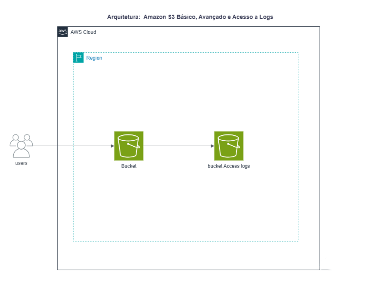
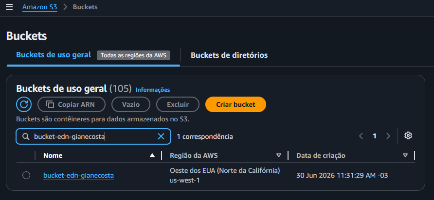
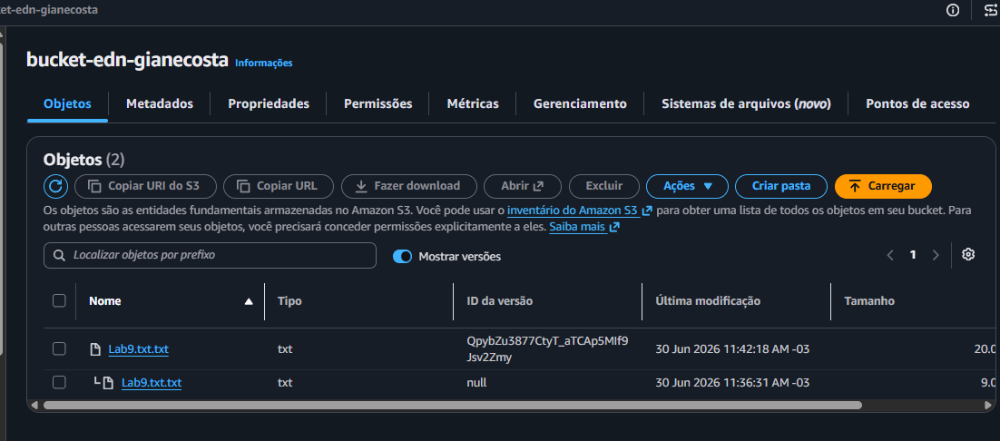
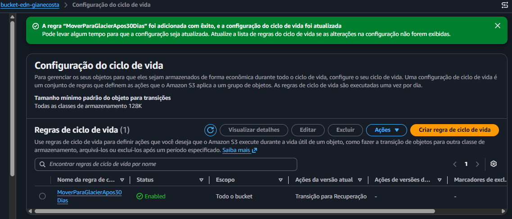
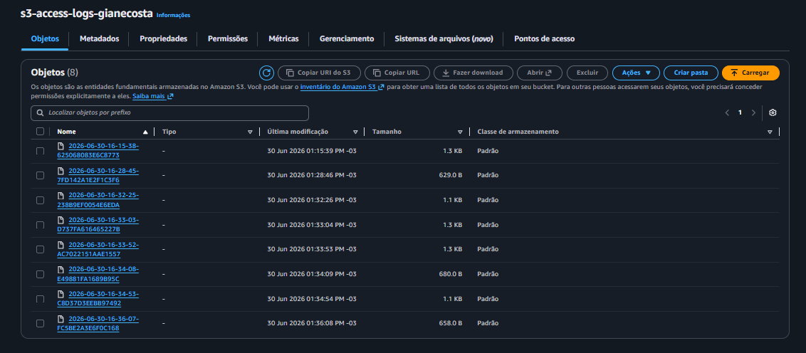

# ☁️ Laboratório: Amazon S3 Básico, Avançado e Acesso a Logs

## 📖 Descrição do Projeto
Este repositório contém a documentação técnica e as evidências de implementação do laboratório prático focado nos recursos essenciais e avançados do **Amazon S3 (Simple Storage Service)**. O objetivo principal foi aplicar as práticas recomendadas de segurança, controle de custos, integridade de dados e auditoria em um cenário real de gerenciamento de armazenamento na nuvem.

A arquitetura implantada consiste em um fluxo de dados e governança utilizando dois buckets dedicados: um para o armazenamento operacional dos objetos da aplicação e um segundo bucket isolado focado exclusivamente na retenção dos logs de acesso ao servidor.

---

## 🛠️ Tecnologias e Recursos Utilizados
*   **Amazon S3 (Simple Storage Service)**: Armazenamento de objetos escalável baseado na nuvem.
*   **S3 Block Public Access**: Mecanismo de segurança para mitigar riscos de vazamento de dados via bloqueio total de acessos públicos.
*   **S3 Object Versioning**: Versionamento de arquivos para proteção contra exclusões acidentais e manutenção do histórico.
*   **S3 Lifecycle Policies**: Automatização de gerenciamento de ciclo de vida com transições automáticas para classes de baixo custo (**Glacier Instant Retrieval**) e expiração programada de objetos.
*   **S3 Server Access Logging**: Rastreabilidade e auditoria de requisições enviadas ao repositório de arquivos.
*   **URLs Pré-assinadas**: Compartilhamento seguro e temporário de arquivos confidenciais com limitação de tempo de expiração.

---

## 📐 Arquitetura do Projeto
O fluxo abaixo descreve a interação do usuário com o ecossistema do Amazon S3, demonstrando a segregação dos dados da aplicação em relação aos registros consolidados de auditoria:

---

## 🚀 Passo a Passo Executado

### 1. Criação e Endurecimento de Segurança dos Buckets
*   Implantação do bucket principal (`bucket-edn-gianecosta`) seguindo as recomendações de isolamento por padrão da AWS.
*   Ativação do **Bloqueio de Todo o Acesso Público** (*Block Public Access*).
*   Manutenção das propriedades de criptografia padrão baseadas no lado do servidor com chaves gerenciadas pelo próprio serviço (SSE-S3).

### 2. Gerenciamento de Histórico e Versionamento de Objetos
*   Habilitação do recurso de **Versionamento** (*Object Versioning*) nas propriedades do bucket.
*   Realização de testes práticos manipulando o arquivo de auditoria simulado `Lab9.txt`, gerando estados sequenciais de dados (*Versão 1* e *Versão 2*) sob o mesmo identificador de chave de objeto.
*   Simulação de procedimentos de recuperação e download de versões históricas de arquivos.

### 3. Otimização de Custos com Regras de Ciclo de Vida
*   Desenvolvimento e aplicação da regra de ciclo de vida descritiva chamada `MoverParaGlacier Apos30Dias` aplicada a todo o escopo do bucket.
*   **Regra de Transição**: Movimentação automática de objetos vigentes para a classe **Glacier Instant Retrieval** exatamente **30 dias** após a sua data de criação, visando a redução de custos de armazenamento frio.
*   **Regra de Expiração**: Exclusão e expiração automatizada dos objetos vigentes no **31º dia**, impedindo o acúmulo desnecessário de dados sem uso comercial e eliminando custos contínuos.

### 4. Links Seguros com URLs Pré-assinadas
*   Geração de chaves temporárias para compartilhamento seguro do arquivo `Lab9.txt`.
*   Definição de uma janela de expiração restrita a **1 minuto** para fins de teste dinâmico.
*   Validação de consumo externo bem-sucedido via utilização de guias anônimas e validação do bloqueio de requisição após a janela temporal de expiração estipulada.

### 5. Ativação de Logs de Acesso e Auditoria
*   Provisionamento de um segundo bucket dedicado denominado `s3-access-logs-gianecosta` para centralizar as trilhas de auditoria.
*   Configuração e ativação do recurso de **Registro em log de acesso ao servidor** (*Server Access Logging*) nas propriedades do bucket principal, apontando os registros brutos para o repositório secundário.
*   Simulação de eventos dinâmicos e validação física da entrega dos logs de operação consolidados pela AWS.

---

## 📸 Evidências de Implantação (Validação Prática)

Abaixo estão listadas as comprovações visuais que atestam o pleno funcionamento das configurações executadas, atendendo aos critérios de avaliação do laboratório:

### 1. Buckets Criados no Amazon S3
*Evidência da presença dos repositórios criados com as convenções nominais de segurança corretas.*

### 2. Versionamento Ativado & Histórico de Objetos
*Comprovação das múltiplas versões mantidas de forma íntegra para o arquivo de teste Lab9.txt.*

### 3. Regra de Ciclo de Vida Criada
*Exibição das políticas de transição de armazenamento para a classe Glacier Instant Retrieval e expiração configuradas de forma automatizada.*

### 4. Registro em Log de Acesso ao Server Ativado
*Validação da consolidação dos arquivos de log de auditoria sendo recebidos com sucesso no bucket dedicado.*

---

## 🧑‍💻 Autoria
*   **Desenvolvedora:** Giane do Nascimento Costa
*   **Curso:** Análise e Desenvolvimento de Sistemas (UNINTER) / AWS Certified Developer Track
*   **Instituição de Treinamento:** Escola da Nuvem